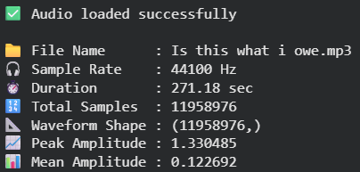
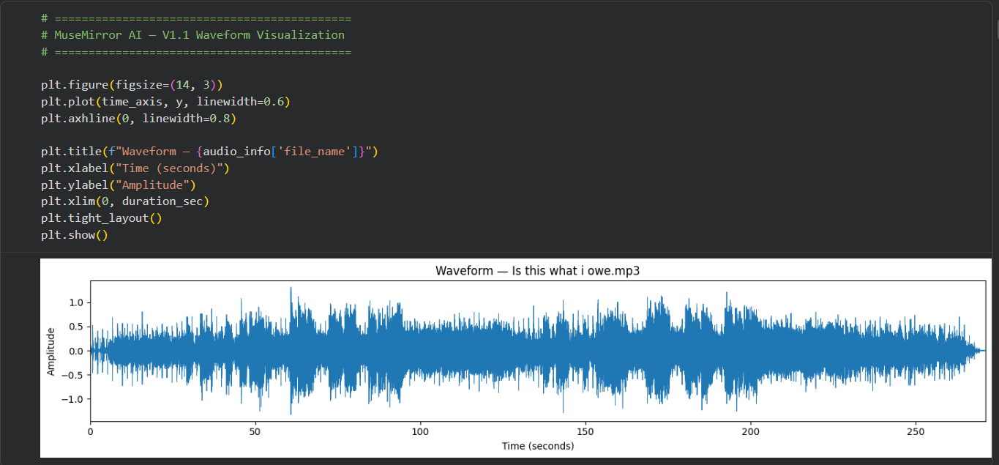
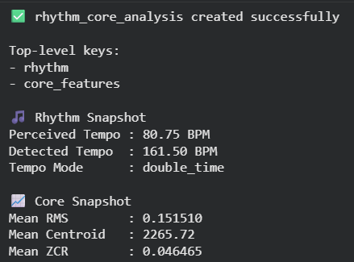
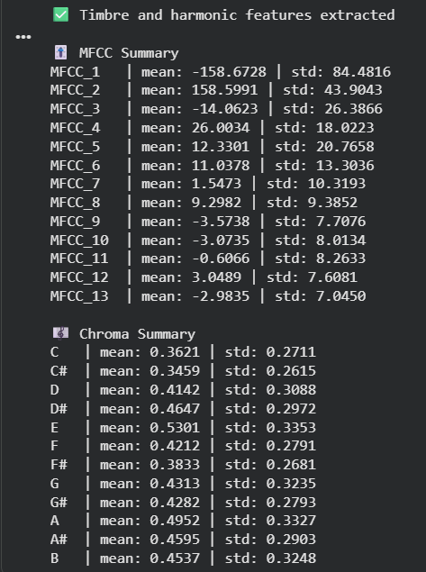
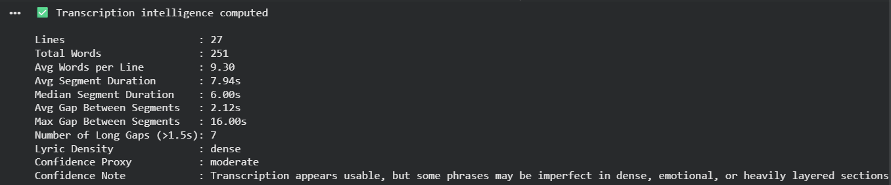
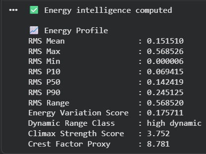
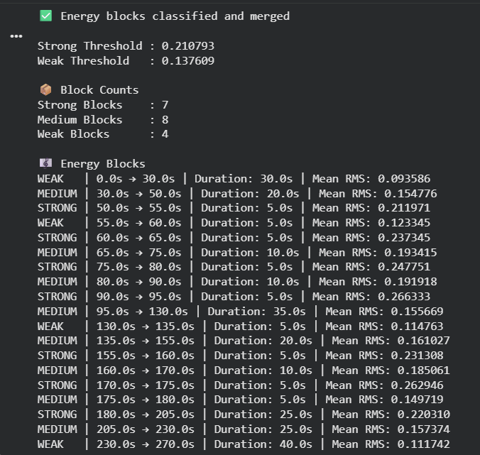
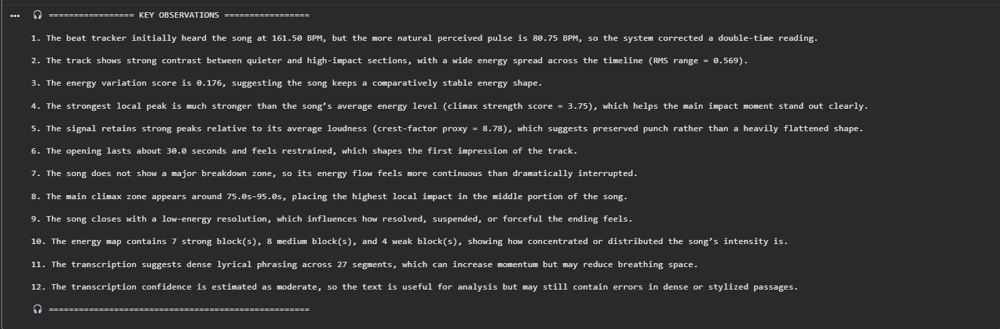
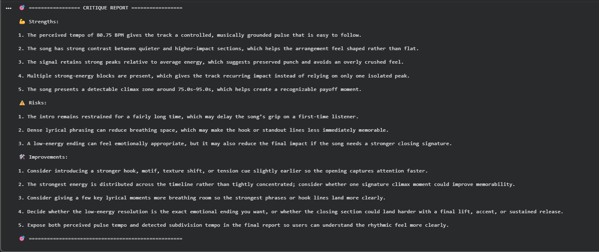
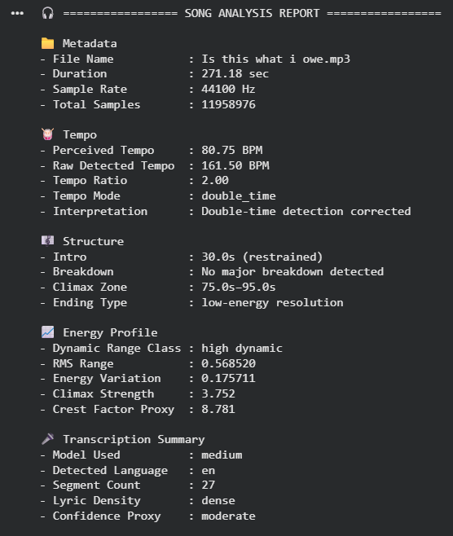

\# MuseMirror AI 🎧


MuseMirror AI is a creator-focused music analysis system that goes beyond raw audio feature extraction and attempts to interpret songs in a musically meaningful way.


It combines signal-level analysis, energy modeling, structural inference, transcription-based insights, and critique generation into a single end-to-end workflow.


\---


\## 🚀 Why this project?


Most music analysis demos stop at low-level features like tempo, MFCC, or spectral descriptors.


MuseMirror AI was built to go further:

\- detect perceived tempo instead of blindly trusting raw detection  

\- analyze how energy evolves across time  

\- infer structural cues like intro, breakdown, climax, and ending  

\- generate human-readable observations  

\- provide creator-oriented critique  


\---


\## 🧠 Key Capabilities


\### 🥁 Rhythm \& Tempo

\- Raw tempo detection  

\- Perceived tempo correction  

\- Tempo ratio and tempo mode  


\### 📈 Core Audio Features

\- RMS energy  

\- Spectral centroid  

\- Zero crossing rate  


\### 🎚️ Timbre \& Harmonic Features

\- MFCC summaries  

\- Chroma summaries  


\### 🎤 Transcription Layer

\- Whisper-based transcription  

\- Segment cleaning  

\- Lyric density estimation  

\- Confidence proxy  


\### ⚡ Energy Intelligence

\- RMS percentiles  

\- Energy variation score  

\- Dynamic range classification  

\- Climax strength score  

\- Window-level energy analysis  

\- Strong / Medium / Weak block detection  


\### 🎼 Structure Intelligence

\- Intro detection  

\- Breakdown detection  

\- Climax zone estimation  

\- Ending type classification  


\### 🧠 Interpretation Layer

\- Key observations (human-readable)  

\- Critique report:

&#x20; - Strengths  

&#x20; - Risks  

&#x20; - Improvements  


\### 📦 Export System

\- Compact report JSON  

\- Full archive JSON  

\- Validation before export  


\---


\## 📂 Project Structure


```text

musemirror-ai/

├── notebooks/

│   ├── MuseMirror\_V1.ipynb

│   └── MuseMirror\_V1\_1.ipynb

│

├── sample\_outputs/

│   ├── v1\_1/

│   │   ├── json/

│   │   └── screenshots/

│   │

│   └── v2/

│       ├── json/

│       └── screenshots/

│

├── assets/

├── docs/

├── .gitignore

├── README.md

└── requirements.txt

```


\---


\## 📊 Example Output


MuseMirror AI produces structured outputs such as:

\- perceived tempo  

\- energy profile  

\- structure summary  

\- key observations  

\- critique report  

\- JSON exports  


\---


\## ⚙️ Tech Stack


\- Python  

\- Librosa  

\- NumPy  

\- Pandas  

\- Matplotlib  

\- OpenAI Whisper  

\- Google Colab  


\---


\## 🧪 Versions


\- \*\*V1\*\* → baseline pipeline  

\- \*\*V1.1\*\* → refined version  


\---


\## ⚠️ Limitations


This system uses heuristic interpretation and should not be treated as absolute musical truth.


\- spectral centroid ≠ full brightness perception  

\- zero crossing rate ≠ distortion directly  

\- structure inferred from energy  

\- transcription depends on audio quality  


\---


\## 👨‍💻 My Contribution


I designed the project direction, analysis goals, and system architecture.


Used AI assistance for development, while making decisions on:

\- feature selection  

\- interpretation logic  

\- pipeline structure  

\- critique generation  

\- output presentation  


\---


\## 🎯 Future Direction (V2)


\- smarter section detection  

\- chorus vs verse energy comparison  

\- richer spectral features  

\- reference track comparison  

\- improved critique intelligence  


\---


\## 📌 Goal


To build a creator-focused music intelligence system.


\---


\## 📸 Sample Outputs


### Audio Properties



### Waveform



### Rhythm Analysis



### Timbre Features



### Transcription



### Energy



### Energy Blocks



### Observations



### Critique



### Final Report



